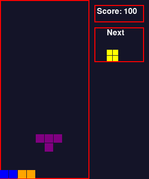

# Tetris

A classic Tetris game built with Python and pygame.



## Installation

```bash
uv sync
```

## Run

```bash
uv run main.py
```

## Controls

| Key | Action |
|-----|--------|
| Left Arrow | Move piece left |
| Right Arrow | Move piece right |
| Down Arrow | Soft drop |
| Space | Rotate piece |
| P | Pause/Resume |
| R | Restart (when game over) |
